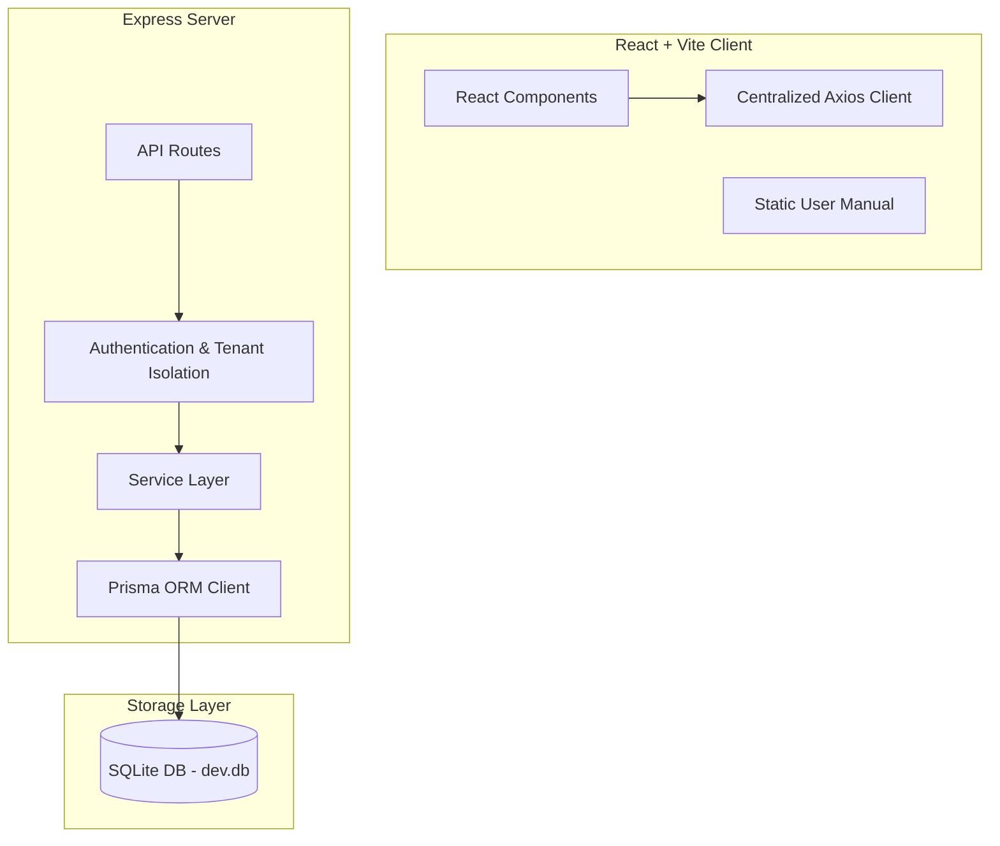

# Aion Portfolio Intelligence — Developer Hand-Off & System Design Guide

Welcome to the Aion developer handover documentation. This guide is designed for developers taking over the maintenance and future extension of the Aion Enterprise Time Logger codebase. It outlines the architectural patterns, security controls, database schema, local setup, and testing procedures.

---

## 🏗️ 1. System Architecture & Design

Aion is structured as a decoupled, multi-tenant monorepo built using a modern TypeScript/Node.js stack.



### 1.1 Backend Service Layer Pattern
To maintain high cohesion and low coupling, all business logic is strictly encapsulated within the service classes located in `src/services/`.
- **API Routes (`src/routes/`)**: Focus solely on HTTP request validation, session parsing, and returning JSON payloads.
- **Service Layer (`src/services/`)**: Implements database interactions, state updates, validation checks, and business calculations. No route handlers should execute raw Prisma queries directly.

### 1.2 Frontend Architecture
- **Vite & React (TypeScript)**: Located in the `/frontend` directory.
- **Centralized API Client (`frontend/src/api/client.ts`)**: All requests to the backend must go through this Axios client instance to ensure correct authorization headers are appended automatically. Do not use raw browser `fetch` calls.
- **User Manual (`frontend/public/tutorial/manual.html`)**: A client-side bilingual (EN/TH) glassmorphic interactive user manual served as a static asset, featuring embedded visual `.webp` walkthroughs.

### 1.3 Database Schema Design (Prisma)
Aion uses SQLite as its database engine. Below is a summary of the core entities configured in `prisma/schema.prisma`:
- **`Organization`**: Supports multi-tenancy. Also implements parent-child relationships for company hierarchies. Custom branding assets (brandColor, logoUrl) are stored here.
- **`User`**: Linked to an `Organization`. Supports self-referential reporting hierarchies via `managerId` for team alignment.
- **`Project`**: Root entity for work allocations, scoped to an organization.
- **`Phase`**: Represents project stages (e.g., Planning, Execution, QA).
- **`PlannedTask`**: Hierarchical Work Breakdown Structure (WBS) tasks. Directly links to parent tasks, projects, assignees, and progress rates.
- **`TimeEntry`**: Records work hours logged by users, referencing projects, phases, and planned tasks. Defaults to `DRAFT` status.
- **`AuditLog`**: Logs system modifications (actions, entities, changed values) for compliance tracing.
- **`Holiday`**: Defines organization-specific holidays.

---

## 🔒 2. Multi-Tenant Isolation Strategy

Aion implements strict **multi-tenant isolation** to prevent cross-tenant data leaks:
- **Middleware Guard (`src/middleware/auth.ts`)**: Validates the JWT bearer token, extracting the caller's `orgId` and role.
- **Filtering Mandate**: All database queries inside services must filter results by the caller's `orgId` (or `organizationId`).
- **Database Rules**: Never fetch or modify a record (User, Project, TimeEntry, WBS task) without explicitly matching its parent organization:
  ```typescript
  // Example Service Pattern
  const project = await prisma.project.findFirst({
    where: {
      id: projectId,
      orgId: currentUser.orgId // Enforces tenant isolation
    }
  });
  ```
- **Automated Verification**: Run `npm run test` to verify tenant isolation rules, tested in `tests/admin.test.ts` and `tests/organizations.test.ts`.

---

## ⚙️ 3. Environment Setup & Configuration

Follow these steps to run a local instance of Aion from scratch:

### 3.1 Prerequisites
- **Node.js**: v18+ recommended.
- **npm**: v9+ recommended.

### 3.2 Installation
1. Clone the repository and install root and frontend dependencies:
   ```bash
   npm install
   npm run install --prefix frontend
   ```
2. Configure environmental settings by duplicating `.env.example` to `.env`:
   ```bash
   cp .env.example .env
   ```
   *Required settings:*
   - `DATABASE_URL="file:./dev.db"`
   - `JWT_SECRET="your-secure-secret-key-change-in-production"`

### 3.3 Database Operations
Generate the local SQLite database and seed the system default users and organizations:
```bash
npx prisma db push
npm run seed
```

### 3.4 Seeded Accounts
The seed script populates the database with default accounts under the organization `Stitch Corp` (and a default `Super Admin` organization):
- **Super Admin**: `superadmin@example.com` / `password123`
- **Admin**: `admin@stitch.com` / `password123`
- **User (Alice)**: `alice@stitch.com` / `password123`
- **User (Bob)**: `bob@stitch.com` / `password123`

### 3.5 Running Locally
Start the concurrent backend API server (port `5050`) and Vite development web server (port `5173`):
```bash
npm run dev
```

---

## 🧪 4. Testing Architecture

Aion uses **Vitest** for unit and integration testing, paired with **Supertest** for testing HTTP endpoints.

### 4.1 Running Tests
Execute the entire test suite sequentially:
```bash
npm run test
```
*Note: `--fileParallelism=false` is enforced in the package.json test script because SQLite is a file-based database. Concurrent tests attempting writes on the same SQLite file will trigger database lock collisions.*

### 4.2 Test Suite Matrix
The codebase contains 16 dedicated test suite files under `/tests/`:
1. **`setup.ts`**: Global configuration, test DB seeding helper, and clean setup operations.
2. **`system_invariants.test.ts`**: Verifies database connectivity and essential read/write routines.
3. **`health.test.ts`**: Validates health check endpoints.
4. **`auth.test.ts`**: Verifies signups, logins, tokens, and general credential verification.
5. **`team.test.ts`**: Checks managers, user hierarchies, and roster grids.
6. **`projects.test.ts`**: Validates project create/read/update/delete operations.
7. **`plans.test.ts`**: Validates Gantt chart plans and planning schedule entries.
8. **`api_entries.test.ts`**: Asserts time entry log submissions, drafts, and bulk submissions.
9. **`reports.test.ts`**: Validates capacity heatmaps, calculations, and allocations.
10. **`admin.test.ts`**: Validates tenant isolation and settings overrides.
11. **`audit.test.ts`**: Asserts change event records inside database tables.
12. **`ids.test.ts`**: Checks that the Intrusion Detection System successfully intercepts malicious payloads.
13. **`rateLimiter.test.ts`**: Asserts lockout counters and login attempts.
14. **`security.test.ts`**: Confirms strength requirements on user credentials.
15. **`adminStatus.test.ts`**: Tests system metrics, locks, unlocks, and Super Admin panel routes.
16. **`suggestions.test.ts`**: Tests the recommendation matrix for smart task log suggest.

---

## 📋 5. Developer Verification Scenarios (Test Cases)

When making modifications to Aion, perform these manual verification scenarios to verify functional stability.

### Scenario 1: Tenant Registration & Workspace Setup
1. **Action**: Navigate to `http://localhost:5173/` and click the Registration link. Register a new tenant organization (e.g., `Acme Corp`) and admin account.
2. **Expected UI Behavior**: Redirects to the login page. Logging in redirects to an empty Dashboard showing "Welcome, Admin".
3. **Database Assertion**: Inspect table `Organization` and `User` to verify records exist with matched `orgId`.

### Scenario 2: Project WBS Creation & Gantt Chart
1. **Action**: Log in as `admin@stitch.com`. Go to Projects and create a new project called `Alpha Dev`. Create a Phase called `Sprint 1`. Go to Plans, select `Alpha Dev` and `Sprint 1`, and create a planned task structure:
   - Parent Task: `Core API` (10 planned hours)
     - Sub-Task: `Auth Refactor` (6 planned hours)
     - Sub-Task: `Schema Setup` (4 planned hours)
2. **Expected UI Behavior**: The planned tasks nest correctly in the task tree. Navigating to Reports > Charts displays the Gantt timeline showing the duration bar and task dependencies.
3. **Database Assertion**: Verify `PlannedTask` table registers parent-child relationships via `parentId`.

### Scenario 3: Bulk Onboarding Teams
1. **Action**: Go to Team Settings. Download the bulk user import template (`frontend/public/templates/bulk_users_filled.xlsx`), add two new users with emails `dev1@stitch.com` and `dev2@stitch.com` under the manager `admin@stitch.com`, and upload the spreadsheet.
2. **Expected UI Behavior**: A success notification triggers. The roster grid refreshes immediately showing both new members with roles and correct reporting manager.
3. **Database Assertion**: Verify new user records contain `managerId` referencing `admin@stitch.com`'s user ID.

### Scenario 4: Time Logging & Weekly Submission
1. **Action**: Log in as `alice@stitch.com`. On the Dashboard, select Project `Alpha Dev`, Phase `Sprint 1`, Task `Auth Refactor`, enter `4` hours, write "Implemented session stores", and click Log Time. Go to the Time Logs page. Select the draft entry and click Submit.
2. **Expected UI Behavior**: The dashboard timer logs the entry as a draft. In the Time Logs list, the entry status switches from `DRAFT` to `SUBMITTED`.
3. **Database Assertion**: Verify `TimeEntry` record transitions its `status` field to `SUBMITTED`.

### Scenario 5: Capacity Analytics Heatmaps
1. **Action**: Log in as `admin@stitch.com`. Navigate to Reports > Charts. View the Resource Heatmap.
2. **Expected UI Behavior**: A color-coded capacity chart displays showing team utilization. If a user is allocated more than 8 hours per workday, their grid cell highlights in red. Weekends show as zero allocated hours.

### Scenario 6: Branding Customization & Audit Trails
1. **Action**: Log in as `superadmin@example.com` or `admin@stitch.com`. Go to Admin Settings. Update the primary brand color to `#ff5722` (orange) and upload a company logo. Log out.
2. **Expected UI Behavior**: The login page background glows and button accent colors adapt immediately to the custom orange styling. The logo changes in the navigation header.
3. **Database Assertion**: Verify `AuditLog` table registers a row with `entityType="Organization"`, `action="UPDATE"`, and details the `oldValues` and `newValues`.

---

## 🛡️ 6. Security, Performance & API Docs Architecture

### 6.1 Intrusion Detection System (IDS)
The IDS middleware (`src/middleware/intrusionDetection.ts`) globally scans incoming HTTP requests for malicious signatures. It blocks:
- **SQL Injection**: Input matching patterns like `UNION SELECT`, `OR 1=1`, or command chainings.
- **Directory Traversal**: Paths containing `../` or `/etc/passwd`.
If triggered, the middleware logs a security event in the `AuditLog` table with `entityType="SECURITY"` and responds with HTTP `400 Bad Request`.

### 6.2 Rate-Limiting Lockouts
Brute-force protection is enforced by `loginRateLimiter` (`src/utils/rateLimiter.ts`):
- Tracks failed login counts per email in volatile memory.
- Triggers a **15-minute lockout** after 5 consecutive failures.
- Super Admins can monitor active lockouts and manually clear them in real-time from the System Monitor.

### 6.3 Performance Optimization Caching
An in-memory cache helper (`src/utils/cache.ts`) optimizes frequent read queries:
- Cache gets populated during query actions (e.g. `TimeEntryService.listEntries`).
- Cached records are automatically invalidated on write/delete/update operations.

### 6.4 API Documentation
Interactive API docs are exposed at `/api-docs` using Swagger UI.
- The router (`src/routes/apiDocs.ts`) reads from `docs/openapi.yaml`.
- All request parameters, headers, schemas, and response formats are detailed inside this YAML specification.
- Developers adding new endpoints must append the corresponding paths to the OpenAPI specification.

