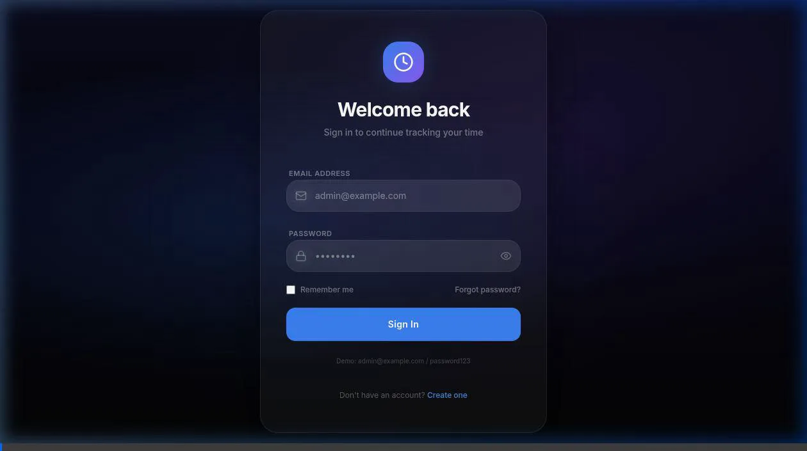

# Aion Enterprise Time Logger

🌐 **Select Language**: English | [ภาษาไทย (Thai)](README.th.md)

Welcome to the **Aion Enterprise Time Logger** — a comprehensive enterprise portfolio management platform designed for precision time logging, strategic project planning, resource intelligence, and enterprise administration.

---

## 📖 Developer & Design Documentation

For a detailed explanation of the code, database schema, multi-tenant isolation, and backend services pattern:
👉 **[Developer Documentation & System Design](DEVELOPER.md)**

---

## ⚡ 1-Line Installation (Windows, Linux, Mac)

Ensure you have **Node.js** and **Git** installed on your system. Run the appropriate command in your terminal to clone the repository and set up the entire workspace automatically:

### Linux / macOS:
```bash
git clone https://github.com/KarinSumi/Time-tracking-WBS.git && cd Time-tracking-WBS && node setup.js
```

### Windows (PowerShell):
```powershell
git clone https://github.com/KarinSumi/Time-tracking-WBS.git; cd Time-tracking-WBS; node setup.js
```

*This automated script installs all dependencies, restores the sample database, and compiles the application.*

---

## 💾 Instant Tryout with Sample Database

To reset the database at any time to the default demo state (with pre-seeded organizations, users, Gantt plans, and time logs):

1. **Restore Sample Database**:
   ```bash
   npm run db:restore-sample
   ```
2. **Run the Application**:
   ```bash
   npm run dev
   ```

### Demo Login Credentials:
- **Super Admin**: `superadmin@example.com` / `password123`
- **Stitch & Co (Org Admin)**: `admin@stitch.com` / `password123`
- **Stitch & Co (Team Member)**: `alice@stitch.com` / `password123`

---

## 🎥 Walkthrough Chapters & Step-by-Step Guides

Below are the 8 core operational chapters. Each contains an auto-playing visual demo walkthrough and the click-by-click instructions to reproduce the actions.

### 1. Account Registration (All Users)
Register a company, create a profile, and log in to the workspace.


🎬 **[Watch MP4 Walkthrough Video](frontend/public/tutorial/assets/01_register_account.mp4)**

#### Steps to replicate:
1. Click the **Register** link at the bottom of the login page.
2. Enter your **Full Name**, **Email Address**, **Organization Name**, and **Password**.
3. Check the **Terms of Service & Privacy Policy** agreement checkbox.
4. Click the blue **Create Account** button.
5. Enter your registered email and password on the login screen, then click **Sign In**.

---

### 2. Dashboard Navigation (All Users)
Understand widgets, active assignments, and the work logs calendar.


🎬 **[Watch MP4 Walkthrough Video](frontend/public/tutorial/assets/02_login_dashboard.mp4)**

#### Steps to replicate:
1. Observe the **Weekly Timesheet widget** showing total hours logged for the current week.
2. Review the **Active Tasks** panel containing tasks assigned to you.
3. Check the **Quick Log** form for daily logging.
4. Hover over the **Weekly Visual Calendar** to view daily work entry density.
5. Browse different modules using the left sidebar navigation menu.

---

### 3. Project & Workspace Setup (Administrators)
Create projects and divide them into phases.


🎬 **[Watch MP4 Walkthrough Video](frontend/public/tutorial/assets/03_project_setup.mp4)**

#### Steps to replicate:
1. Navigate to the **Projects** page in the left sidebar.
2. Click the **Add Project** button in the top right.
3. Enter a project name (e.g., `Stitch Dashboard`), pick a color theme, and click **Save**.
4. Click the **Phases** tab next to your newly created project.
5. Click **Add Phase**, input the phase name (e.g., `Build`), and click **Save**.

---

### 4. Work Breakdown Structure - WBS (Administrators)
Construct hierarchical plans and timeline Gantt charts.


🎬 **[Watch MP4 Walkthrough Video](frontend/public/tutorial/assets/04_task_planning.mp4)**

#### Steps to replicate:
1. Navigate to the **Plans** page in the left sidebar.
2. Select your target **Project** and **Phase** from the dropdown filters.
3. Click the **Add Task** button to create a task in the WBS list.
4. Enter the **Task Description**, **Start/End Dates**, **Planned Hours**, and assign it to a teammate.
5. Set the **Parent Task** dropdown to build nested task groups (e.g., nested under `Project Foundation`).
6. Click **Save** to render the hierarchical tree and the interactive **Gantt Chart**.

---

### 5. Team & Member Onboarding (Administrators)
Onboard your team roster in bulk.


🎬 **[Watch MP4 Walkthrough Video](frontend/public/tutorial/assets/05_bulk_upload.mp4)**

#### Steps to replicate:
1. Go to the **Team** page from the sidebar navigation.
2. Click the **Bulk Register** button to open the spreadsheet upload modal.
3. Click **Download Template** to download the standard Excel file.
4. Populate the spreadsheet with team member names, emails, roles (USER/ADMIN), and manager emails.
5. Upload or drag-and-drop the populated Excel spreadsheet, then click **Upload**.
6. Verify that the team grid updates instantly with the new members and manager lines.

---

### 6. Time Logging & Submissions (All Users)
Submit operational work logs for review.


🎬 **[Watch MP4 Walkthrough Video](frontend/public/tutorial/assets/06_time_logging.mp4)**

#### Steps to replicate:
1. Locate the **Quick Log Time** widget on the Dashboard.
2. Select the **Project**, **Phase**, and the **WBS Planned Task** you worked on.
3. Input the **Worked Hours** (e.g., `4`) and enter a descriptive summary of your task.
4. Click **Log Time** (saves the entry in a `DRAFT` status).
5. Navigate to the **Time Logs** page, check the draft entries, and click **Submit** to request approval.

---

### 7. Resource Analytics & Heatmaps (Administrators)
Track team capacity, over-allocation, and utilization.


🎬 **[Watch MP4 Walkthrough Video](frontend/public/tutorial/assets/07_analytics_reports.mp4)**

#### Steps to replicate:
1. Click **Reports** in the sidebar navigation, then choose the **Capacity** tab.
2. Set the **Start Date** and **End Date** filters to select your sprint range.
3. Inspect the **Resource Capacity Heatmap**:
   - 🟩 **Green**: Normal allocation (up to 8 hours/day).
   - 🟥 **Red**: Over-allocated resource status (>8 hours/day).
   - ⬛ **Grey**: Weekends and corporate holidays.
4. Click the **Export Report** button to download a CSV format capacity report.

---

### 8. Superadmin Config & Branding (Super Admins)
Customize logos and branding accents organization-wide.


#### Steps to replicate:
1. Log in as a **Super Admin** or authorized Administrator and navigate to the **Admin** settings.
2. Locate the **Branding Customization** panel.
3. Set your preferred corporate theme color hex code (e.g., `#ff5722` for orange).
4. Upload your company's **Logo** image file.
5. Click **Save Customization** and observe the header logo and theme colors update instantly.
